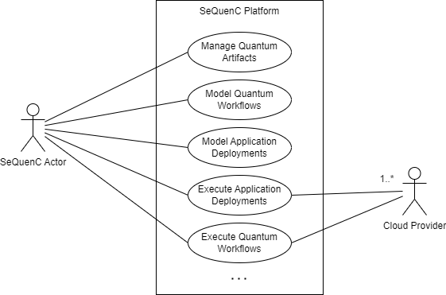
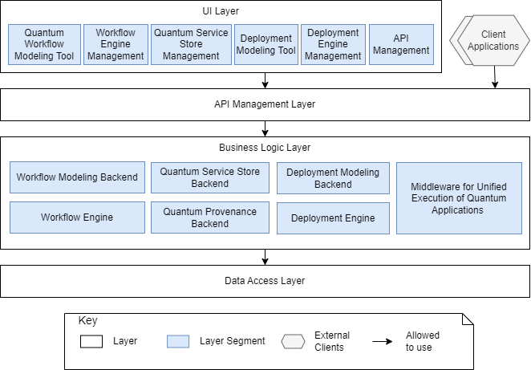

This repository acts as a knowledge base for the [SeQuenC project](sequenc.de) that aims to provide a technical methodology and a platform for uniform design and execution of quantum applications for different quantum service providers.
This repository intends to provide a comprehensive overview of the supported use cases and involved actors, the SeQuenC platform architecture and the tools it encompasses.

# Table of Contents
* [SeQuenC Platform Overview](#sequenc-platform-overview)
  * [SeQuenC Actors](#sequenc-actors)
  * [Platform Use Cases](#platform-use-cases)
* [SeQuenC Platform Architecture](#sequenc-platform-architecture)
* [SeQuenC Tools](#sequenc-tools)
  * [Modeling and Execution of Quantum Workflows](#modeling-and-execution-of-quantum-workflows)
  * [Unification Layer](#unification-layer)
  * [Quantum Service Store](#quantum-service-store)  
  * [Deployment Automation](#deployment-automation)  

# SeQuenC Platform Overview

The SeQuenC platform and associated tools/services are intended to facilitate the exploitation and integration of quantum software in the cloud. One of the core goals of the platform is to enable unified access to available quantum hardware offered as heterogeneous cloud services by general-purpose cloud providers such as IBM or AWS, and specialized infrastructure providers such as IonQ and QMware. As multiple pre- and post-processing steps in quantum applications must be implemented on classical hardware, the platform emphasizes the role of workflows and provides mechanisms for workflow-based design and execution of quantum applications. The platform and its associated tools are developed as open source software and made available to interested parties for their own use or further development.

## SeQuenC Actors

The SeQuenC actors are as follows:

* Quantum Software Developer: responsible for implementation of quantum programs and testing.
* Workflow Modeler: responsible for modeling the workflow-based integration of classical and quantum parts that can be automatically enacted using a compatible workflow engine.
* Operations Engineer (Ops): responsible for delivery on the infrastructure and infrastructure testing.

## Platform Use Cases

The platform realizes multiple use cases surrounding the topic of workflow-based quantum software development. The UML Use Case diagram below shows some major use cases supported by the platform:

* UC1 [Manage Quantum Artifacts]. SeQuenC actors such as Quantum Software Developer or Workflow Modeler manage the repository of available quantum artifacts (store, browse, updated, etc.), which include available quantum circuit implementations, e.g., in OpenQASM format, and quantum programs, e.g., implemented in Python. Additionally, the repository also includes workflow models that integrate such quantum artifacts with other classical parts required in the application, e.g., classical Python code for post-processing the circuit execution results.

* UC2 [Model Quantum Workflows]. SeQuenC actors (see Workflow Modeler) can graphically create workflow models that represent desired orchestrations of classical and quantum parts that constitute a to-be-executed quantum application. Produced workflow models can be stored for future reuse as described in UC1. 

* UC3 [Model Application Deployments]. To enable the automated orchestration of heterogeneous classical and quantum parts that constitute quantum applications, they need to be deployed according to existing infrastructure requirements. To avoid the inefficient and error-prone manual deployments, SeQuenC provides mechanisms for modeling and automated deployment of quantum applications. Hence, SeQuenC actors (see Operations Engineer) can represent the desired deployment using the deployment modeling tool. 

* UC4 [Execute Application Deployments]. The produced deployment models can be automatically executed by the compatible deployment automation engine available as a part of the SeQuenC platform. After successfully deploying the classical and quantum parts that constitute the target quantum application, the corresponding quantum workflow can be executed.

* UC5 [Execute Quantum Workflows]. The produced workflow models can be automatically enacted using a compatible workflow engine available as a part of the SeQuenC platform. 

## SeQuenC Use-Cases

| Items | Contents |
| --- | --- |
| **Short Description** |  This repository collects the use-cases for the SeQuenC project. The use-cases are documented in the respective directory and reflect different scenarios and tools. |
| **Documentation** | Inside the repository for the specific use-case. |
| **Repository** | <https://github.com/SeQuenC-Consortium/SeQuenC-UseCases> |
| **Licence**| Licensed under the Apache License 2.0. |

# SeQuenC Platform Architecture

The SeQuenC project aims to provide a platform covering both the design and runtime phases for unified execution of quantum applications on heterogeneous quantum cloud services. To achieve this, the platform enables multiple functionalities, such as modeling of workflows and application deployments, automated execution of produced models using the corresponding workflow and deployment orchestration engines, etc.
The figure below shows a layer view of the SeQuenC platform comprising groupings of implementation units. In the following, the elements of this view are discussed in more detail.

## View Element Catalog
In the depicted layered architecture view, some layers are divided into segments to provide a finer-grained representation of elements constituting the layer. Layers and their segments are described below.

### UI Layer
This layer groups the elements that enable SeQuenC actors to interact with the platform. This includes various graphical user interfaces, such as workflow and deployment modeling tools, as well as management interfaces, e.g., for managing internal and external APIs.

**Quantum Workflows Modeling Tool.**
This element represents a graphical modeling tool that is responsible for graphical specification of quantum workflows and provides the following functionalities:
* Specification of the desired orchestration of classical and quantum parts that constitute a quantum application
* Transformation of the created quantum workflow into a standard-compliant workflow format (BPMN 2.0)
* Persisting and opening created models
* Trigger the enactment for created models on a compatible workflow engine (Camunda workflow engine)

**Workflow Engine Management.**
This element represents a management tool that provides a GUI for interacting with the workflow engine, which includes the following functionalities:
* Managing the state of workflow instances, e.g., pause or terminate
* Monitor the execution

**Quantum Service Store Management.**
This element represents a management tool that provides a GUI for interacting with the service store and includes the following functionalities:
* CRUD operations for managing quantum artifacts such as circuits or workflow models

**Deployment Modeling Tool.**
This element represents a tool that provides a GUI for creating deployment models for quantum applications using the TOSCA CML. Deployment modeling tool provides the following functionalities:
* Creation and management of deployment modeling constructs, e.g., representing specific cloud persistence or infrastructure services
* Creation and management of deployment topologies that represent hybrid, quantum-classical applications and the related components

**Deployment Engine Management.**
This element represents a tool that provides a GUI for managing the deployments enacted using the deployment engine. This includes such features as execution of multiple instances of a deployment model, monitoring their status, and cancelling running deployments.

**API Management.**
To facilitate design, publishing, and management of public and private APIs exposed by platform components, an API Management solution such as WSO2 API Manager can be utilized.
An API Management GUI tool serves as an entry point for interacting with API management functionalities of the platform.

### Business Logic Layer
This layer groups the elements implementing business functionalities.

**Workflow Modeling Backend.**
This element realizes the business logic for modeling and management of quantum workflows.

**Workflow Engine.**
The Workflow Engine is responsible for coordinating the execution of modeled quantum workflows and keeping track of the status of the workflow instances throughout its lifecycle.

**Quantum Service Store Backend.**
This element realizes the business logic for managing quantum artifacts.

**Quantum Provenance Backend.**
This element realizes the business logic for collecting and analyzing important provenance attributes about quantum computations. This helps to support different use cases, such as selecting suitable quantum hardware for the execution of a quantum circuit, providing a basis for transpilers and optimizers, or finding the origins of errors in quantum computations.

**Deployment Modeling Backend.**
This element realizes the business logic for modeling and managing of deployment models.

**Deployment Engine.**
The Deployment Engine is responsible for coordinating the execution of created deployment models and providing the status of the deployment model instances throughout their lifecycle.

**Middleware for Unified Execution of Quantum Applications.**
This element represents a middleware that provides unified access to various quantum services.

* Provides a REST-API for unified calls, such that it facilitates the usage of quantum services.
* Achieves Platform Autonomy by providing a translation to target formats which is suitable for the chosen quantum service. 

### Data Access Layer

This layer groups the elements that are used for persistence of the data artifacts, such as workflow and deployment models, quantum artifacts, etc.

# SeQuenC Tools

## Modeling and Execution of Quantum Workflows
Quantum applications are inherently hybrid as they comprise both classical and quantum-specific parts.
For example, the input for quantum algorithms may need to be pre-processed using classical hardware.
Furthermore, post-processing steps may be needed too, e.g., error mitigation methods may need to be utilized due to the error-proneness of contemporary quantum devices.
Therefore, the SeQuenC architecture emphasizes the role of workflows for development of quantum applications and incorporates tools for graphical modeling of quantum workflows and their automated execution.

### Quantum Workflows Modeling Tool

| Items | Contents |
| --- | --- |
| **Short Description** | The Quantum Workflows Modeling Tool in SeQuenC is implemented using QuantME, a modeling and transformation framework that extends Camunda modeler to enable creating quantum workflow models. Specifically, it provides a graphical BPMN modeler supporting Quantum4BPMN modeling extension to ease the modeling of quantum workflows by providing explicit modeling constructs for the execution of quantum circuits and frequently-occurring pre- and post-processing tasks. Furthermore, it enables transforming quantum workflows using Quantum4BPMN modeling constructs to native BPMN workflows to retain their portability between different workflow engines. |
| **Documentation** | [Documentation](https://github.com/UST-QuAntiL/QuantME-TransformationFramework/tree/develop/docs) |
| **Repository** | <https://github.com/UST-QuAntiL/QuantME-TransformationFramework> |
| **Licence**| Licensed under the MIT License. |

### Workflow Engine

| Items | Contents |
| --- | --- |
| **Short Description** | The Workflow Engine in SeQuenC is based on Camunda Engine, a state-of-the-art BPMN workflow engine that runs inside the Java Virtual Machine and can be embedded inside any Java application and any Runtime Container. |
| **Documentation** | [Documentation](https://docs.camunda.org/get-started/) |
| **Repository** | <https://github.com/camunda/camunda-bpm-platform> |
| **Licence**| Licensed under the Apache License 2.0. |

## Unification Layer
Quantum computers are not commodity hardware and offered as cloud services by various providers including general-purpose cloud providers such as IBM and AWS, and specialized providers focusing on quantum computing use cases such as Rigetti or IonQ. 
One of the core requirements in SeQuenC is, therefore, to provide uniform mechanisms for executing quantum applications on various quantum cloud services overcoming their heterogeneous requirements and feature sets.
These uniform mechanisms for handling different quantum execution tasks, monitoring their status, etc. consitute the so-called Unification Layer in the SeQuenC platform architecture.

| Items | Contents |
| --- | --- |
| **Short Description** | The Unification Layer in SeQuenC is a new middleware component called Qunicorn that provides a uniform API for management and execution of quantum jobs on different service providers. |
| **Documentation** | [Documentation](https://qunicorn-core.readthedocs.io/en/latest/#) |
| **Repository** | <https://github.com/qunicorn/qunicorn-core> |
| **Licence**| Licensed under the Apache License 2.0. |

## Quantum Service Store

To facilitate the management and reuse of developed quantum programs and workflow models, the SeQuenC architecture incorporates a service store and management tool, which is integrated with other components of the platform.
For examples, quantum algorithm implementations can be referenced as parts of quantum workflows using the SeQuenC workflow modeling environment. 
Furthermore, to enable modeling custom provisioning requirements, the deployment automation tools in SeQuenC can be used to create custom executable deployment models for the quantum artifacts in the Service Store.

| Items | Contents |
| --- | --- |
| **Short Description** | The Service Store and Service Registry in SeQuenC are implemented based on the QC Atlas, an open source platform for sharing quantum software developed as part of the project PlanQK. Service Store enables the collection and management of information about quantum algorithms, available implementations, publications, available software platforms, cloud services, and their offered compute resources such as quantum computers and simulators. |
| **Documentation** | [Documentation](https://quantil.readthedocs.io/en/latest/user-guide/qc-atlas/) |
| **Repository** | <https://github.com/UST-QuAntiL/qc-atlas> / <https://github.com/UST-QuAntiL/qc-atlas-ui> |
| **Licence**| Licensed under the Apache License 2.0. |

## Deployment Automation
The SeQuenC platform architecture incorporates tools for modeling and enacting the automated deployment of quantum applications. 
Since the current prototype relies on TOSCA for deployment automation, to facilitate graphical creation of TOSCA models, the platform incorporates a GUI-based deployment modeling tool based on Eclipse Winery. 
The produced models can be enacted by TOSCA-compliant orchestrators such as OpenTOSCA Container, which is integrated in the prototype too.

### Deployment Modeling Tool

| Items | Contents |
| --- | --- |
| **Short Description** | The Deployment Modeling Tool in SeQuenC is developed based on Eclipse Winery, which is a web-based environment to graphically model TOSCA-based application topologies. It includes (i) a Management GUI for managing TOSCA types and templates, (ii) a Topology Modeler GUI that enables to graphically compose application topologies and specify configuration properties, and (iii) a file-based backend to store, import, and export TOSCA models. |
| **Documentation** | [Documentation](https://winery.readthedocs.io/) |
| **Repository** | <https://github.com/OpenTOSCA/winery> / <https://github.com/eclipse/winery> |
| **Licence**| Dual licensed under the Apache License 2.0 and Eclipse Public License 2.0. |

### Deployment Orchestrator

| Items | Contents |
| --- | --- |
| **Short Description** | The Deployment Orchestrator in SeQuenC is based on the OpenTOSCA Container, a TOSCA deployment automation engine that enables automatic provisioning of cloud applications by analyzing the TOSCA model and invoking the Build Plan to instantiate a new application instance. If there is no Build Plan available, the container generates a Build Plan on its own. To enable the management of a certain application instance during its lifetime, the OpenTOSCA Container is able to execute arbitrary Management Plans, which can be modeled manually or generated for provisioning. |
| **Documentation** | [Documentation](https://opentosca.github.io/container/) |
| **Repository** | <https://github.com/OpenTOSCA/container/> |
| **Licence**| Licensed under the Apache License 2.0. |
